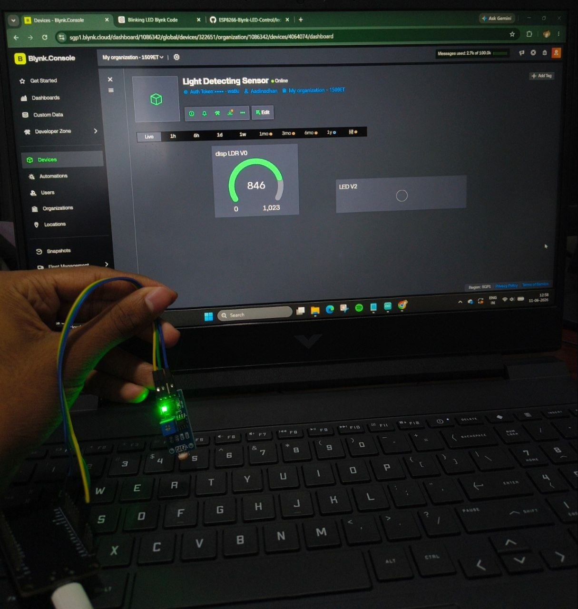
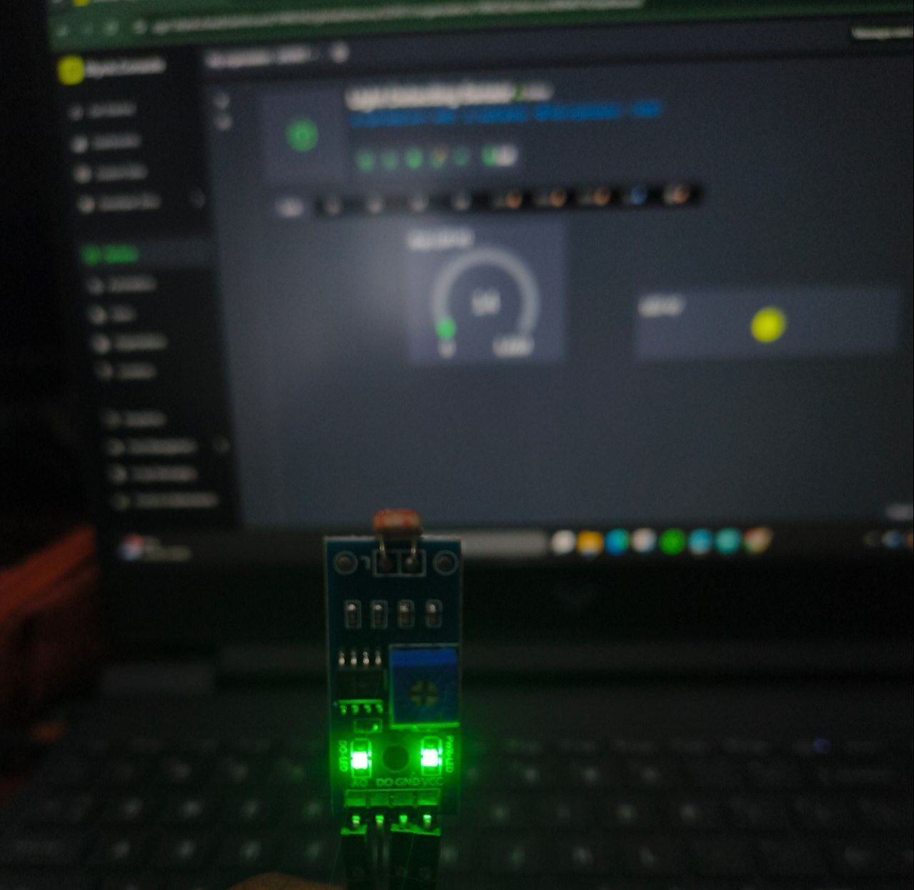

# ESP8266 LDR Light Monitoring System 💡📡

An IoT-based light monitoring system using ESP8266 NodeMCU and an LDR (Light Dependent Resistor) sensor to measure ambient light intensity and display the readings in real-time using the Blynk IoT platform.

---

## 🚀 Features

* Real-time light intensity monitoring
* Wireless data transmission over WiFi
* Live visualization using Blynk dashboard
* Automatic dark/bright indication using LED widget
* Beginner-friendly IoT project

---

## 🧰 Hardware Used

* NodeMCU ESP8266
* LDR (Light Dependent Resistor)
* 10kΩ Resistor
* Breadboard
* Jumper Wires

---

## 📱 Software Used

* Arduino IDE
* Blynk IoT Platform

---

## ⚙️ Working Principle

1. The LDR senses the ambient light level.
2. ESP8266 reads the analog value from the LDR through pin A0.
3. Sensor data is sent to the Blynk Cloud using WiFi.
4. The Blynk dashboard displays the live LDR value.
5. An LED widget indicates whether the environment is bright or dark.

---

## 📌 Virtual Pin Mapping

| Virtual Pin | Function         |
| ----------- | ---------------- |
| V0          | LDR Sensor Value |
| V2          | Light Status LED |

---

## 🔌 Connections

| Component  | NodeMCU Pin |
| ---------- | ----------- |
| LDR Output | A0          |
| VCC        | 3.3V        |
| GND        | GND         |

---

## 📸 Project Output

### Hardware Setup

The hardware setup consists of a NodeMCU ESP8266 connected to an LDR sensor. The ESP8266 reads ambient light intensity through the analog pin and transmits the data to Blynk via WiFi.

### Blynk Dashboard

The Blynk dashboard displays the live LDR value using a Gauge widget. An LED widget indicates the lighting condition:

* LED On → Dark environment
* LED Off → Bright environment

---

## ⚡ How It Works

* The ESP8266 reads the LDR value every second.
* The sensor value is displayed on a Blynk Gauge Widget connected to V0.
* If the light level is low (dark environment), the Blynk LED widget on V2 turns ON.
* If the light level is high (bright environment), the Blynk LED widget on V2 turns OFF.

---

## 👨‍💻 Author

Aadinadhan R Nair

---

## ⭐ Status

✔ Working Project
✔ Tested on ESP8266 NodeMCU
✔ Successfully Integrated with Blynk IoT
✔ Real-Time Light Monitoring
